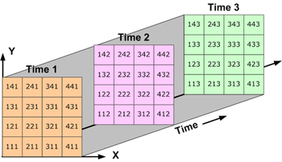

This is second R notebook on working with climate data. In the last notebook, we introduced the programming constructs a "variable" and a "function". We then worked with 1 and 2 dimensional ascii data to make some scatter plots. In this notebook, we will introduce new functions for opening and working with 3 dimensional data, and higher dimensional data. Let's get started! 

# 3 dimensional climate data - NetCDF files.
It's unlikely you have heard of NetCDF as a file type. NetCDF files are like a stack of spreadsheets ontop of each other. See the picture below. 


To work with netcdf files in R, you need to install a couple of packages. R is such a popular language for data analysis because it has thousands of packages which can be downloaded (for free!) with a single line of code. These packages range from forecasting time series for weather analysis or stock prices, to geospatial, to higher performance parallelisation routines, to..... you get the picture. If you can think of a scientific problem, there's probably already a package for it in R. 

In R, you install a package once using the "install.package()" function. This normally only needs to be done once on a computer. Then the package must be loaded into R with the "library()" function. This needs to be done every time you restart R. Let's load the ncdf4 package. 

```{r}
install.packages("ncdf4")
```

You should see a load of both black and red text flash by on the screen. The important bit is the last few lines, which should say thing have been loaded ok. Specifically, the final line should say "* DONE ([the package name])". The package then needs to be loaded into R. 

```{r}
library("ncdf4")
```
You shouldn't see any output from running this line of code, but we can now use the functions in the ncdf4 library. 


```{r}
knitr::purl("Rmd_script_2_NetCDF.Rmd")
```